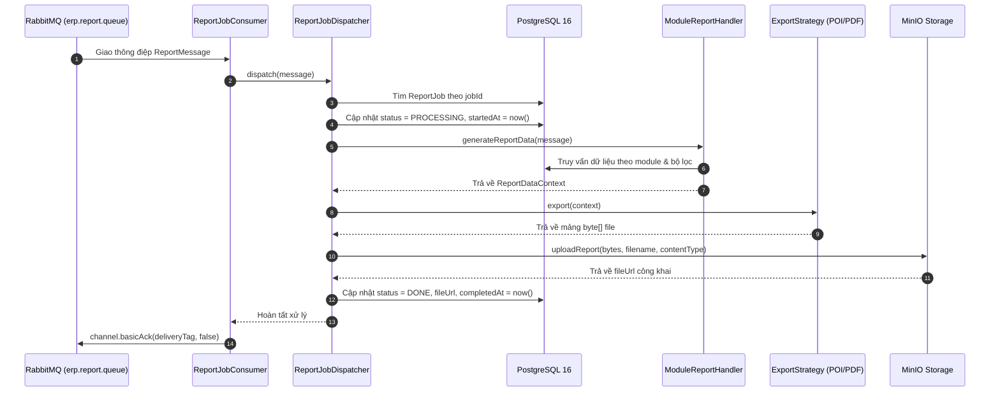
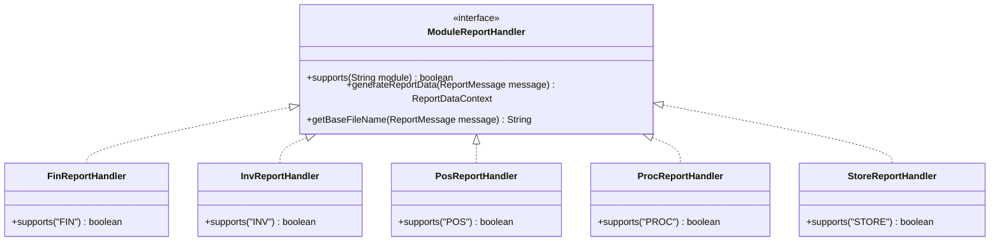

# ⚡ ERP Queue Service (`queue-service`)
> **Dịch vụ Xử lý Hàng đợi & Xuất Báo cáo Bất đồng bộ trong Hệ sinh thái ERP Pine Drink (ERP-UTT)**

---

## 🧭 MỤC LỤC
1. [Tổng quan dịch vụ (Project Overview)](#1-tổng-quan-dịch-vụ-project-overview)
2. [Kiến trúc & Luồng xử lý nghiệp vụ (System Architecture & Business Flow)](#2-kiến-trúc--luồng-xử-lý-nghiệp-vụ-system-architecture--business-flow)
   - [2.1. Sơ đồ Kiến trúc Tổng thể](#21-sơ-đồ-kiến-trúc-tổng-thể)
   - [2.2. Luồng Xử lý Một Thông điệp Báo cáo](#22-luồng-xử-lý-một-thông-điệp-báo-cáo)
   - [2.3. Cơ chế Dead Letter Queue (DLQ) & Khả năng Chịu lỗi](#23-cơ-chế-dead-letter-queue-dlq--khả-năng-chịu-lỗi)
3. [Tính năng cốt lõi (Core Features)](#3-tính-năng-cốt-lõi-core-features)
4. [Chi tiết các Phân hệ Báo cáo (Supported Modules & Handlers)](#4-chi-tiết-các-phân-hệ-báo-cáo-supported-modules--handlers)
5. [Đặc tả Hàng đợi & Thông điệp (Messaging Specification)](#5-đặc-tả-hàng-đợi--thông-điệp-messaging-specification)
   - [5.1. Topology RabbitMQ](#51-topology-rabbitmq)
   - [5.2. Cấu trúc Message Payload (`ReportMessage`)](#52-cấu-trúc-message-payload-reportmessage)
6. [Công nghệ sử dụng (Tech Stack)](#6-công-nghệ-sử-dụng-tech-stack)
7. [Cấu trúc thư mục mã nguồn (Repository Structure)](#7-cấu-trúc-thư-mục-mã-nguồn-repository-structure)
8. [Hướng dẫn cài đặt & Khởi chạy (Getting Started)](#8-hướng-dẫn-cài-đặt--khởi-chạy-getting-started)
   - [8.1. Yêu cầu Môi trường](#81-yêu-cầu-môi-trường)
   - [8.2. Khởi chạy Cục bộ từng bước](#82-khởi-chạy-cục-bộ-từng-bước)
9. [Cấu hình hệ thống (Configuration & Environment Variables)](#9-cấu-hình-hệ-thống-configuration--environment-variables)
10. [Chiến lược Kết xuất File (Export Strategies)](#10-chiến-lược-kết-xuất-file-export-strategies)
11. [Lưu trữ Tệp với MinIO (Object Storage)](#11-lưu-trữ-tệp-với-minio-object-storage)
12. [Đóng gói Docker & Triển khai (Containerization)](#12-đóng-gói-docker--triển-khai-containerization)
13. [Giám sát & Vận hành (Monitoring & Health Checks)](#13-giám-sát--vận-hành-monitoring--health-checks)

---

## 1. Tổng quan dịch vụ (Project Overview)

`queue-service` là dịch vụ xử lý nền (Background Worker / Consumer Service) hoạt động độc lập trong hệ thống ERP-UTT. Nhiệm vụ chính của dịch vụ là:

* **Tách tải bất đồng bộ (Asynchronous Offloading):** Tiếp nhận các tác vụ xuất dữ liệu, thống kê và kết xuất báo cáo phức tạp từ `backend-service` thông qua RabbitMQ, giải phóng tài nguyên CPU/RAM cho máy chủ API trung tâm, đảm bảo các giao dịch bán hàng (POS), nhập xuất kho (INV) và đơn mua (PO) luôn phản hồi tức thì.
* **Xử lý Báo cáo Đa phân hệ:** Tổng hợp số liệu từ cơ sở dữ liệu PostgreSQL cho 5 phân hệ lớn: Tài chính (`FIN`), Kho vận (`INV`), Bán hàng (`POS`), Mua hàng (`PROC`), và Quản trị Cửa hàng (`STORE`).
* **Đa dạng hóa định dạng xuất bản:** Tạo file bảng tính chuyên nghiệp **Microsoft Excel (.xlsx)** bằng Apache POI và tài liệu **PDF (.pdf)** chất lượng cao qua OpenPDF.
* **Lưu trữ đám mây & Phân phối:** Đóng gói và tải file báo cáo lên kho lưu trữ **MinIO Object Storage** theo cấu trúc thư mục ngày tháng (`reports/yyyy/MM/dd/{uuid}_{filename}`), cấp phát URL truy cập an toàn cho người dùng cuối.
* **Bảo toàn trạng thái tác vụ:** Cập nhật tiến độ của `ReportJob` trong CSDL xuyên suốt vòng đời (`PENDING` $\rightarrow$ `PROCESSING` $\rightarrow$ `DONE` / `FAILED`).

---

## 2. Kiến trúc & Luồng xử lý nghiệp vụ (System Architecture & Business Flow)

### 2.1. Sơ đồ Kiến trúc Tổng thể

```
[ Client / Web Browser ]
         │
         │ 1. Gửi yêu cầu xuất báo cáo (POST /api/v1/reports)
         ▼
┌─────────────────────────────────────────────────────────────┐
│                       BACKEND SERVICE                       │
│  - Lưu bản ghi ReportJob (PENDING)                          │
│  - ReportMessagePublisher gửi message vào RabbitMQ          │
└──────────────────────────────┬──────────────────────────────┘
                               │
                               │ 2. AMQP Publish: erp.report.exchange
                               ▼
┌─────────────────────────────────────────────────────────────┐
│                      RABBITMQ BROKER                        │
│  - Exchange: erp.report.exchange (Direct)                   │
│  - Routing Key: report.generate                             │
│  - Queue: erp.report.queue                                  │
│  - DLX: erp.report.dl.exchange ──> DLQ: erp.report.dlq      │
└──────────────────────────────┬──────────────────────────────┘
                               │
                               │ 3. AMQP Consume (Manual ACK, Prefetch: 1)
                               ▼
┌─────────────────────────────────────────────────────────────┐
│                   QUEUE SERVICE (Worker)                    │
│                                                             │
│  ┌───────────────────────────────────────────────────────┐  │
│  │ 1. ReportJobConsumer: Bắt message, điều phối          │  │
│  └───────────────────────────┬───────────────────────────┘  │
│                              ▼                              │
│  ┌───────────────────────────────────────────────────────┐  │
│  │ 2. ReportJobDispatcher: Đổi trạng thái PROCESSING     │  │
│  └───────────────┬───────────────────────────┬───────────┘  │
│                  ▼                           ▼              │
│  ┌──────────────────────────────┐ ┌──────────────────────┐  │
│  │ 3. ModuleReportHandler       │ │ 4. ExportStrategy    │  │
│  │    (FIN, INV, POS, PROC,     │ │    - Excel (POI)     │  │
│  │     STORE) truy vấn dữ liệu  │ │    - PDF (OpenPDF)   │  │
│  └───────────────┬──────────────┘ └──────────┬───────────┘  │
│                  │                           │              │
│                  ▼                           ▼              │
│  ┌───────────────────────────────────────────────────────┐  │
│  │ 5. MinioStorageService: Upload file nhị phân          │  │
│  └───────────────────────────┬───────────────────────────┘  │
│                              ▼                              │
│  ┌───────────────────────────────────────────────────────┐  │
│  │ 6. Cập nhật ReportJob -> DONE (kèm URL) & Gửi ACK     │  │
│  └───────────────────────────────────────────────────────┘  │
└──────────────────┬───────────────────────────┬──────────────┘
                   │                           │
                   ▼                           ▼
        ┌─────────────────────┐     ┌─────────────────────┐
        │    PostgreSQL 16    │     │    MinIO Storage    │
        │    (Dữ liệu & Job)  │     │   (erp-reports)     │
        └─────────────────────┘     └─────────────────────┘
```

---

### 2.2. Luồng Xử lý Một Thông điệp Báo cáo



---

### 2.3. Cơ chế Dead Letter Queue (DLQ) & Khả năng Chịu lỗi

Nhằm ngăn chặn tình trạng mất mát thông điệp hoặc thông điệp lỗi gây nghẽn hàng đợi vĩnh viễn (Poison Pill):

1. **Xác nhận Thủ công (Manual Acknowledgment):**
   * Chỉ khi toàn bộ quy trình: Truy vấn CSDL $\rightarrow$ Kết xuất file $\rightarrow$ Tải lên MinIO $\rightarrow$ Ghi nhận CSDL hoàn tất thành công, consumer mới gửi lệnh `basicAck`.
2. **Xử lý Ngoại lệ & Định tuyến DLQ:**
   * Khi gặp lỗi không phục hồi được (dữ liệu sai, lỗi kết nối MinIO, hết bộ nhớ...), `ReportJobConsumer` ghi log lỗi chi tiết, cập nhật `ReportJob` sang trạng thái `FAILED` kèm thông điệp lỗi `errorMessage`.
   * Gửi tín hiệu `channel.basicNack(deliveryTag, false, false)` với `requeue = false`.
   * RabbitMQ tự động đẩy thông điệp sang **Dead Letter Exchange (`erp.report.dl.exchange`)** với routing key `report.dead` vào **`erp.report.dlq`**.
3. **Message TTL (Time-To-Live):**
   * Hàng đợi chính được thiết lập `x-message-ttl = 1,800,000 ms` (30 phút). Nếu thông điệp tồn đọng quá 30 phút mà không có worker xử lý, nó sẽ tự động được điều chuyển sang DLQ.

---

## 3. Tính năng cốt lõi (Core Features)

| Phân hệ / Nhóm chức năng | Thành phần chịu trách nhiệm | Mô tả chi tiết |
| :--- | :--- | :--- |
| **RabbitMQ Consumer** | `ReportJobConsumer` | Nhận message, xử lý đồng thời (concurrency 2 - 5), prefetch = 1, kiểm soát ACK/NACK thủ công. |
| **Trung tâm Điều phối** | `ReportJobDispatcher` | Quản lý trạng thái tác vụ trong DB, tìm đúng Handler nghiệp vụ và áp dụng Chiến lược kết xuất file. |
| **Báo cáo Tài chính (FIN)** | `FinReportHandler` | Thống kê tổng hợp doanh thu, chi phí, dòng tiền, báo cáo doanh thu theo ca và theo ngày của chi nhánh. |
| **Báo cáo Kho vận (INV)** | `InvReportHandler` | Xuất bảng cân đối xuất-nhập-tồn, cảnh báo nguyên vật liệu dưới định mức tối thiểu, định giá tồn kho. |
| **Báo cáo Bán hàng (POS)** | `PosReportHandler` | Tổng hợp hóa đơn bán lẻ, phân loại doanh thu theo phương thức thanh toán (Tiền mặt, Chuyển khoản, Thẻ). |
| **Báo cáo Mua hàng (PROC)** | `ProcReportHandler` | Báo cáo chi tiết đơn mua hàng (PO), công nợ NCC, đánh giá hiệu suất nhà cung cấp và biến động giá NVL. |
| **Báo cáo Cửa hàng (STORE)** | `StoreReportHandler` | Báo cáo tổng kết ngày của điểm bán, đối soát tiền két ca làm việc, tổng hợp chỉ số vận hành chi nhánh. |
| **Xuất File Excel** | `ExcelExportStrategy` | Tạo bảng tính `.xlsx` tự động định dạng tiêu đề, căn chỉnh độ rộng cột, định dạng số/tiền tệ và kẻ viền bảng. |
| **Xuất File PDF** | `PdfExportStrategy` | Tạo tài liệu `.pdf` khổ ngang (A4 Landscape) kèm tiêu đề báo cáo, metadata thời gian, bảng dữ liệu xen kẽ màu nền. |
| **Lưu trữ Đám mây** | `MinioStorageService` | Tự động khởi tạo bucket `erp-reports`, phân quyền đọc public, lưu file theo cấu trúc phân cấp ngày tháng. |
| **Giám sát Vận hành** | Spring Boot Actuator | Giám sát tình trạng sống (`/liveness`, `/readiness`), chỉ số kết nối RabbitMQ và MinIO qua Prometheus. |

---

## 4. Chi tiết các Phân hệ Báo cáo (Supported Modules & Handlers)

Dịch vụ triển khai mô hình **Strategy Pattern** linh hoạt. Khi cần thêm một loại báo cáo mới, chỉ cần triển khai thêm phương thức trong Handler hoặc tạo Handler mới kế thừa `ModuleReportHandler` mà không làm thay đổi luồng xử lý chung:



### Bảng tra cứu các Loại Báo cáo hỗ trợ:

| Mã Module | Handler phụ trách | Loại báo cáo (`reportType`) | Bảng CSDL truy vấn chính |
| :---: | :--- | :--- | :--- |
| **`FIN`** | `FinReportHandler` | `FINANCIAL_SUMMARY`<br>`REVENUE_EXPENSE`<br>`DAILY_SUMMARY` | `ia_branch_daily_financial_summary`<br>`ia_branch` |
| **`INV`** | `InvReportHandler` | `STOCK_BALANCE`<br>`LOW_STOCK`<br>`INVENTORY_VALUATION` | `ia_material_stock_balance`<br>`ia_material`<br>`ia_warehouse` |
| **`POS`** | `PosReportHandler` | `SALES_SUMMARY`<br>`ORDER_LIST`<br>`REVENUE_BY_PAYMENT_METHOD` | `ia_order`<br>`ia_branch` |
| **`PROC`** | `ProcReportHandler` | `PURCHASE_ORDER_SUMMARY`<br>`SUPPLIER_PERFORMANCE`<br>`PURCHASE_EXPENSE` | `ia_purchase_order`<br>`ia_supplier` |
| **`STORE`**| `StoreReportHandler`| `STORE_DAILY_REPORT`<br>`SHIFT_REPORT`<br>`BRANCH_ACTIVITY` | `ia_store_daily_report`<br>`ia_shift_report`<br>`ia_branch` |

---

## 5. Đặc tả Hàng đợi & Thông điệp (Messaging Specification)

### 5.1. Topology RabbitMQ

Cấu hình RabbitMQ được định nghĩa tập trung trong `application.yaml` (dưới nhánh `app.rabbitmq.report.*`) và nạp tự động qua [RabbitMQConsumerConfig.java](file:///c:/ERP-UTT/queue-service/src/main/java/com/erp/queue_service/configuration/RabbitMQConsumerConfig.java):

| Thành phần | Tên cấu hình / Mặc định | Loại / Ghi chú |
| :--- | :--- | :--- |
| **Direct Exchange Chính** | `erp.report.exchange` | `DirectExchange` (Durable, Non-auto-delete) |
| **Routing Key Chính** | `report.generate` | Định tuyến thông điệp tạo báo cáo đến hàng đợi xử lý |
| **Hàng đợi Xử lý (Queue)** | `erp.report.queue` | Hàng đợi chứa task chờ xử lý. Kèm cấu hình DLX & TTL |
| **Dead Letter Exchange (DLX)**| `erp.report.dl.exchange`| `DirectExchange` tiếp nhận thông điệp xử lý thất bại |
| **DLQ Routing Key** | `report.dead` | Khóa định tuyến thông điệp lỗi vào DLQ |
| **Dead Letter Queue (DLQ)** | `erp.report.dlq` | Lưu trữ message gặp sự cố để phục vụ truy vết & replay |
| **Message TTL** | `1800000` (ms) | Thời gian sống tối đa 30 phút trong hàng đợi chính |

---

### 5.2. Cấu trúc Message Payload (`ReportMessage`)

Thông điệp JSON được serialize / deserialize qua Jackson Converter:

```json
{
  "jobId": "f47ac10b-58cc-4372-a567-0e02b2c3d479",
  "module": "PROC",
  "reportType": "PURCHASE_ORDER_SUMMARY",
  "format": "EXCEL",
  "requestedBy": "11111111-2222-3333-4444-555555555555",
  "branchId": "aaaaaaaa-bbbb-cccc-dddd-eeeeeeeeeeee",
  "params": {
    "startDate": "2026-08-01",
    "endDate": "2026-08-31",
    "status": "APPROVED",
    "supplierId": "99999999-8888-7777-6666-555555555555"
  },
  "createdAt": "2026-09-18T10:15:30Z"
}
```

#### Giải thích các trường dữ liệu:
* `jobId` *(UUID, bắt buộc)*: Khóa chính của bản ghi `ReportJob` cần theo dõi tiến độ trong CSDL.
* `module` *(String, bắt buộc)*: Mã phân hệ (`FIN`, `INV`, `POS`, `PROC`, `STORE`).
* `reportType` *(String, bắt buộc)*: Tên nghiệp vụ báo cáo chi tiết.
* `format` *(String, tùy chọn)*: Định dạng tệp mong muốn (`EXCEL` hoặc `PDF`, mặc định là `EXCEL`).
* `requestedBy` *(UUID)*: ID của người dùng khởi tạo yêu cầu xuất báo cáo.
* `branchId` *(UUID, tùy chọn)*: ID chi nhánh (nếu phạm vi báo cáo giới hạn theo chi nhánh cụ thể).
* `params` *(Map<String, Object>)*: Bộ lọc động (khoảng ngày, trạng thái, danh mục, NCC...).
* `createdAt` *(Instant)*: Thời điểm khởi tạo yêu cầu.

---

## 6. Công nghệ sử dụng (Tech Stack)

* **Ngôn ngữ & Nền tảng:** Java 21 LTS, Spring Boot 4.1.0.
* **Message Broker:** RabbitMQ 3.13+, Spring AMQP (Spring RabbitMQ).
* **Cơ sở dữ liệu & Truy vấn:** PostgreSQL 16, Spring Data JPA, Hibernate ORM 7.
* **Thư viện lõi DTO/Domain:** `erp-core-model` (Bản quyền nội bộ ERP-UTT).
* **Xử lý Bảng tính Excel:** Apache POI (`poi-ooxml` 5.3.0).
* **Xử lý Tài liệu PDF:** OpenPDF / LibrePDF 2.0.3.
* **Lưu trữ Object Storage:** MinIO Java Client SDK 8.5.11.
* **Giám sát & Quản trị:** Spring Boot Actuator, Micrometer Prometheus.
* **Containerization:** Docker Multi-stage Build (Alpine JRE 21).

---

## 7. Cấu trúc thư mục mã nguồn (Repository Structure)

```
queue-service/
├── pom.xml                                   # Cấu hình Maven Dependencies & Build Plugin
├── Dockerfile                                # Multi-stage Docker build tối ưu kích thước
├── src/
│   ├── main/
│   │   ├── java/com/erp/queue_service/
│   │   │   ├── QueueServiceApplication.java  # Lớp Entrypoint khởi chạy Worker Service
│   │   │   │
│   │   │   ├── configuration/                # Cấu hình hệ thống
│   │   │   │   ├── JacksonConfiguration.java # Cấu hình Jackson ObjectMapper (JavaTimeModule)
│   │   │   │   ├── MinioConfig.java          # Cấu hình MinioClient & khởi tạo bucket
│   │   │   │   └── RabbitMQConsumerConfig.java# Topology Exchange, Queue, DLQ, ListenerFactory
│   │   │   │
│   │   │   ├── consumer/                     # Bộ lắng nghe hàng đợi
│   │   │   │   └── ReportJobConsumer.java    # @RabbitListener, kiểm soát Manual ACK & NACK
│   │   │   │
│   │   │   ├── export/                       # Chiến lược kết xuất tệp
│   │   │   │   ├── ExportStrategy.java       # Interface chiến lược kết xuất file
│   │   │   │   ├── ExportStrategyFactory.java# Factory lấy strategy theo định dạng (EXCEL/PDF)
│   │   │   │   ├── ExcelExportStrategy.java  # Tạo bảng tính Excel (.xlsx) qua Apache POI
│   │   │   │   ├── PdfExportStrategy.java    # Tạo tài liệu PDF (.pdf) qua OpenPDF
│   │   │   │   ├── ReportColumnDefinition.java# Định nghĩa cột (tiêu đề, trường, định dạng)
│   │   │   │   └── ReportDataContext.java    # Record chứa dữ liệu và metadata báo cáo
│   │   │   │
│   │   │   ├── handler/                      # Xử lý dữ liệu nghiệp vụ
│   │   │   │   ├── ModuleReportHandler.java  # Interface chuẩn cho từng phân hệ
│   │   │   │   ├── ReportJobDispatcher.java  # Bộ điều phối trung tâm (Dispatcher)
│   │   │   │   ├── fin/FinReportHandler.java # Báo cáo phân hệ Tài chính
│   │   │   │   ├── inv/InvReportHandler.java # Báo cáo phân hệ Kho vận
│   │   │   │   ├── pos/PosReportHandler.java # Báo cáo phân hệ Điểm bán lẻ
│   │   │   │   ├── proc/ProcReportHandler.java# Báo cáo phân hệ Mua sắm
│   │   │   │   └── store/StoreReportHandler.java# Báo cáo phân hệ Cửa hàng
│   │   │   │
│   │   │   ├── messaging/                    # Mô hình thông điệp
│   │   │   │   └── ReportMessage.java        # DTO thông điệp nhận từ RabbitMQ
│   │   │   │
│   │   │   ├── repository/                   # Tầng truy vấn CSDL (Spring Data JPA)
│   │   │   │   ├── ReportJobRepository.java  # Cập nhật trạng thái tiến trình xuất file
│   │   │   │   ├── PurchaseOrderRepository.java
│   │   │   │   ├── OrderRepository.java
│   │   │   │   └── ... (Các Repository truy vấn theo phân hệ)
│   │   │   │
│   │   │   └── service/                      # Dịch vụ hạ tầng
│   │   │       └── MinioStorageService.java  # Tải tệp lên MinIO & trả URL tải xuống
│   │   │
│   │   └── resources/
│   │       ├── application.yaml              # Cấu hình gốc mặc định
│   │       └── application-dev.yaml          # Cấu hình môi trường phát triển (Development)
│   └── test/                                 # Unit & Integration Tests
```

---

## 8. Hướng dẫn cài đặt & Khởi chạy (Getting Started)

### 8.1. Yêu cầu Môi trường

1. **Java Development Kit:** JDK 21 LTS trở lên.
2. **Maven:** 3.9+ (hoặc sử dụng wrapper `mvnw.cmd` / `./mvnw`).
3. **Cơ sở dữ liệu:** PostgreSQL 16 (chung CSDL `erp_dev` với `backend-service`).
4. **Message Broker:** RabbitMQ 3.13+ (có kích hoạt management plugin).
5. **Object Storage:** MinIO Server (cổng mặc định 9000).

---

### 8.2. Khởi chạy Cục bộ từng bước

#### Bước 1: Build & Cài đặt thư viện dùng chung `core-model`
Do `queue-service` phụ thuộc trực tiếp vào `erp-core-model`, bạn cần cài đặt nó vào local `.m2` repository trước:
```powershell
# Chạy trên Windows PowerShell
cd c:\ERP-UTT\core-model
..\backend-service\mvnw.cmd clean install -DskipTests
```

#### Bước 2: Kiểm tra Hạ tầng phụ thuộc (PostgreSQL, RabbitMQ, MinIO)
Đảm bảo các dịch vụ hạ tầng sau đang hoạt động:
* **RabbitMQ:** Cổng `5672` (AMQP) và `15672` (Management Dashboard).
* **PostgreSQL:** Cổng `5432` (Database: `erp_dev`).
* **MinIO:** Cổng `9000` (S3 API) và `9001` (Console).

#### Bước 3: Khởi chạy `queue-service`
Tại thư mục `queue-service`:
```powershell
# Khởi chạy trên Windows bằng Maven Wrapper
cd c:\ERP-UTT\queue-service
.\mvnw.cmd spring-boot:run

# Hoặc kích hoạt cụ thể Profile dev
.\mvnw.cmd spring-boot:run -Dspring-boot.run.profiles=dev
```

Sau khi dịch vụ khởi động thành công:
* Cổng dịch vụ: `http://localhost:8090`
* Kiểm tra trạng thái sức khỏe: `http://localhost:8090/actuator/health`

---

## 9. Cấu hình hệ thống (Configuration & Environment Variables)

Tất cả các tham số cấu hình đều có thể được ghi đè linh hoạt thông qua Biến Môi trường (Environment Variables) trong các tệp `.env` hoặc Docker Compose:

| Tên biến môi trường | Khóa cấu hình trong YAML | Giá trị mặc định | Mô tả chi tiết |
| :--- | :--- | :--- | :--- |
| `SERVER_PORT` | `server.port` | `8090` | Cổng HTTP của queue-service (cho Actuator). |
| `SPRING_PROFILES_ACTIVE` | `spring.profiles.active` | `dev` | Profile môi trường hoạt động (`dev`, `prod`). |
| **Cấu hình RabbitMQ** | | | |
| `RABBITMQ_HOST` | `spring.rabbitmq.host` | `localhost` | Địa chỉ máy chủ RabbitMQ Broker. |
| `RABBITMQ_PORT` | `spring.rabbitmq.port` | `5672` | Cổng kết nối AMQP RabbitMQ. |
| `RABBITMQ_USER` | `spring.rabbitmq.username` | `erp_rabbit` | Tài khoản RabbitMQ. |
| `RABBITMQ_PASS` | `spring.rabbitmq.password` | `erp123456@` | Mật khẩu tài khoản RabbitMQ. |
| `RABBITMQ_VHOST` | `spring.rabbitmq.virtual-host` | `erp_vhost` | Virtual Host làm việc trên RabbitMQ. |
| **Cấu hình Queue & Exchange** | | | |
| `RABBITMQ_REPORT_EXCHANGE` | `app.rabbitmq.report.exchange` | `erp.report.exchange` | Direct Exchange tiếp nhận yêu cầu xuất báo cáo. |
| `RABBITMQ_REPORT_DL_EXCHANGE` | `app.rabbitmq.report.dl-exchange` | `erp.report.dl.exchange` | Direct Exchange định tuyến thông điệp lỗi (DLX). |
| `RABBITMQ_REPORT_QUEUE` | `app.rabbitmq.report.queue` | `erp.report.queue` | Hàng đợi chứa tác vụ xuất báo cáo chính. |
| `RABBITMQ_REPORT_DLQ` | `app.rabbitmq.report.dlq` | `erp.report.dlq` | Hàng đợi chứa các tác vụ bị lỗi (DLQ). |
| `RABBITMQ_REPORT_ROUTING_KEY`| `app.rabbitmq.report.routing-key`| `report.generate` | Khóa định tuyến thông điệp báo cáo. |
| `RABBITMQ_REPORT_DL_ROUTING_KEY`| `app.rabbitmq.report.dl-routing-key`| `report.dead` | Khóa định tuyến chuyển lỗi sang DLQ. |
| `RABBITMQ_REPORT_TTL` | `app.rabbitmq.report.ttl` | `1800000` | Thời gian sống (TTL) của message (ms - 30 phút). |
| **Cấu hình Cơ sở dữ liệu** | | | |
| `DB_HOST` | *(Ghép vào DB_URL)* | `163.61.72.183` | Địa chỉ máy chủ PostgreSQL. |
| `DB_PORT` | *(Ghép vào DB_URL)* | `5432` | Cổng PostgreSQL. |
| `DB_NAME` | *(Ghép vào DB_URL)* | `erp_dev` | Tên CSDL hệ thống. |
| `DB_USERNAME` | `spring.datasource.username` | `erp_user` | Tài khoản kết nối CSDL. |
| `DB_PASSWORD` | `spring.datasource.password` | `erp123456@` | Mật khẩu tài khoản CSDL. |
| **Cấu hình MinIO Storage** | | | |
| `MINIO_ENDPOINT` | `app.minio.endpoint` | `http://localhost:9000`| URL dịch vụ MinIO S3 API. |
| `MINIO_ACCESS_KEY` | `app.minio.access-key` | `erp_minio` | Access key (username) MinIO. |
| `MINIO_SECRET_KEY` | `app.minio.secret-key` | `erp123456@` | Secret key (password) MinIO. |
| `MINIO_REPORT_BUCKET` | `app.minio.bucket-name` | `erp-reports` | Tên Bucket lưu trữ tệp báo cáo đã xuất. |
| `MINIO_PUBLIC_URL` | `app.minio.public-url` | `/storage` | Tiền tố đường dẫn URL công khai tải tệp. |

---

## 10. Chiến lược Kết xuất File (Export Strategies)

Dịch vụ hỗ trợ 2 chiến lược định dạng chính thông qua `ExportStrategy`:

### 10.1. Excel Export (`ExcelExportStrategy`)
* **Thư viện:** Apache POI (`XSSFWorkbook`).
* **Định dạng file:** `.xlsx`.
* **MIME Type:** `application/vnd.openxmlformats-officedocument.spreadsheetml.sheet`.
* **Đặc tính kỹ thuật:**
  * Hỗ trợ tạo sheet tự động với tên thân thiện.
  * Tiêu đề lớn màu xanh navy đậm (`RGB: 30, 58, 110`), chữ in hoa, cỡ chữ 16pt.
  * Hiển thị bảng tóm tắt siêu dữ liệu (Thời gian xuất, Người yêu cầu, Chi nhánh, Bộ lọc).
  * Tiêu đề bảng tô nền xám nhạt, in đậm, căn giữa và kẻ viền mỏng toàn bộ ô.
  * Tự động nhận diện và định dạng số: Tiền tệ (`#,##0 ₫`), Số lượng (`#,##0`), Ngày tháng (`dd/MM/yyyy`).
  * Tự động tính toán và điều chỉnh độ rộng cột (`autoSizeColumn`) chống tràn chữ.

### 10.2. PDF Export (`PdfExportStrategy`)
* **Thư viện:** OpenPDF (dựa trên iText).
* **Định dạng file:** `.pdf`.
* **MIME Type:** `application/pdf`.
* **Đặc tính kỹ thuật:**
  * Trang in nằm ngang (**A4 Landscape**) tối ưu hiển thị các bảng dữ liệu nhiều cột.
  * Bảng dữ liệu có thanh tiêu đề nền xanh đậm, chữ trắng in đậm.
  * Các dòng dữ liệu có màu nền xen kẽ (Zebra Striping) giúp người đọc dễ quan sát.
  * Căn lề số học sang bên phải, văn bản sang bên trái, mã định danh căn giữa.

---

## 11. Lưu trữ Tệp với MinIO (Object Storage)

### Quy trình Lưu trữ:
1. Khi khởi động ứng dụng, [MinioConfig.java](file:///c:/ERP-UTT/queue-service/src/main/java/com/erp/queue_service/configuration/MinioConfig.java) tự động kiểm tra xem bucket `erp-reports` đã tồn tại chưa; nếu chưa, tự động tạo mới (`makeBucket`).
2. Gán chính sách **ReadOnly Policy** công khai cho bucket để người dùng frontend có thể tải file thông qua URL trực tiếp hoặc Nginx proxy `/storage/erp-reports/...`.
3. Đường dẫn tệp được phân cấp theo ngày tháng để tránh quá tải danh mục:
   ```
   erp-reports/
   └── reports/
       └── 2026/
           └── 09/
               └── 18/
                   └── 9b1deb4d-3b7d-4bad-9bdd-2b0d7b3dcb6d_BaoCaoMuaHang_20260918_102030.xlsx
   ```

---

## 12. Đóng gói Docker & Triển khai (Containerization)

File [Dockerfile](file:///c:/ERP-UTT/queue-service/Dockerfile) sử dụng cơ chế **Multi-stage Build** nhằm tối ưu kích thước image và nâng cao tính bảo mật:

```dockerfile
# Stage 1: Build source code cùng erp-core-model
FROM eclipse-temurin:21-jdk-alpine AS builder
WORKDIR /workspace
COPY core-model/ core-model/
COPY backend-service/mvnw backend-service/mvnw
COPY backend-service/.mvn backend-service/.mvn
COPY queue-service/ queue-service/
RUN chmod +x backend-service/mvnw
WORKDIR /workspace/core-model
RUN ../backend-service/mvnw clean install -DskipTests
WORKDIR /workspace/queue-service
RUN ../backend-service/mvnw clean package -DskipTests

# Stage 2: Runtime image bảo mật cao với Non-root user
FROM eclipse-temurin:21-jre-alpine
WORKDIR /app
RUN addgroup -S erp && adduser -S erp -G erp
USER erp:erp
COPY --from=builder /workspace/queue-service/target/queue-service-*.jar app.jar
ENV JAVA_OPTS="-Xms256m -Xmx512m -XX:+UseG1GC"
ENV SPRING_PROFILES_ACTIVE="dev"
EXPOSE 8090
ENTRYPOINT ["sh", "-c", "java $JAVA_OPTS -Djava.security.egd=file:/dev/./urandom -jar app.jar"]
```

### Lệnh Build & Run Docker thủ công:
```bash
# Đứng tại thư mục gốc dự án c:/ERP-UTT
docker build -t erp-queue-service:latest -f queue-service/Dockerfile .

# Chạy container kết nối mạng chung với RabbitMQ & PostgreSQL
docker run -d \
  --name erp-queue-service \
  --restart unless-stopped \
  -p 8090:8090 \
  -e SPRING_PROFILES_ACTIVE=dev \
  -e RABBITMQ_HOST=163.61.72.183 \
  -e DB_HOST=163.61.72.183 \
  -e MINIO_ENDPOINT=http://163.61.72.183:9000 \
  erp-queue-service:latest
```

---

## 13. Giám sát & Vận hành (Monitoring & Health Checks)

### 13.1. Các Endpoint Actuator
* **Kiểm tra Sức khỏe Tổng quan:**
  ```http
  GET http://localhost:8090/actuator/health
  ```
  *Trả về trạng thái UP của dịch vụ, kết nối CSDL PostgreSQL và RabbitMQ Broker.*

* **Liveness & Readiness Probes (Dành cho Docker/Kubernetes):**
  ```http
  GET http://localhost:8090/actuator/health/liveness
  GET http://localhost:8090/actuator/health/readiness
  ```

* **Prometheus Metrics:**
  ```http
  GET http://localhost:8090/actuator/prometheus
  ```
  *Cung cấp thông số chi tiết về RAM, CPU, số lượng message tiêu thụ, thời gian thực thi task.*

---

### 13.2. Theo dõi Nhật ký Hoạt động (Logs)
Ví dụ log xử lý thành công một thông điệp:
```text
[RabbitMQ-Consumer] Tiếp nhận thông điệp báo cáo: JobID=3a8f9c12-..., Module=PROC, Type=PURCHASE_ORDER_SUMMARY
[Dispatcher] Bắt đầu xử lý ReportJob ID: 3a8f9c12-..., Module: PROC, Type: PURCHASE_ORDER_SUMMARY
[MinIO] Đã tải lên báo cáo thành công vào bucket 'erp-reports', key 'reports/2026/09/18/uuid_BaoCaoDonMuaHang_20260918_103000.xlsx'
[Dispatcher] Hoàn tất ReportJob ID: 3a8f9c12-.... File URL: /storage/erp-reports/...
[RabbitMQ-Consumer] Đã ACK thành công cho JobID=3a8f9c12-...
```

---

*Tài liệu được cập nhật lần cuối theo phiên bản cấu hình Sprint 2 (Năm 2026).*
