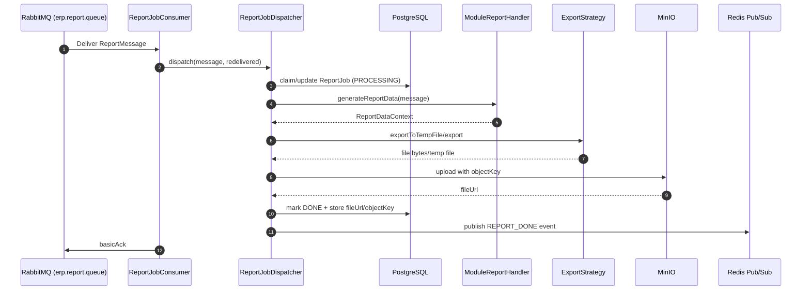
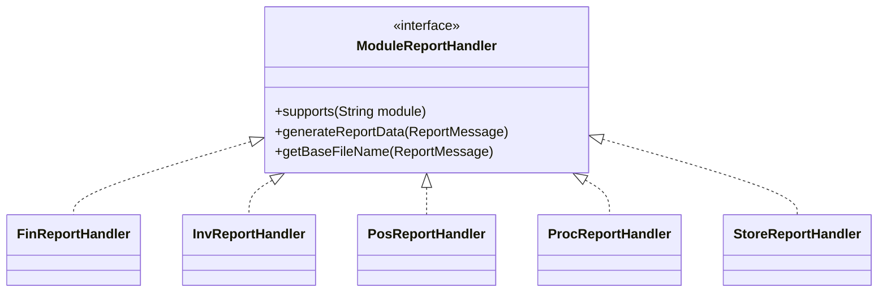

# ERP Queue Service (`queue-service`)

Asynchronous report-generation worker for the ERP ecosystem. This service consumes report jobs from RabbitMQ, generates report files (Excel/PDF), stores files in MinIO, updates report-job state, and publishes completion/failure notifications.

> **Scope note:** This README reflects the current implementation in this repository. Always verify details against source code when configuration or behavior changes.

## Table of Contents

- [1. Purpose and Responsibilities](#1-purpose-and-responsibilities)
- [2. Architecture](#2-architecture)
  - [2.1 High-level System Flow](#21-high-level-system-flow)
  - [2.2 Message Processing Sequence](#22-message-processing-sequence)
  - [2.3 ACK/NACK, Retry, and DLQ Behavior](#23-acknack-retry-and-dlq-behavior)
- [3. Supported Modules and Report Types](#3-supported-modules-and-report-types)
- [4. RabbitMQ Topology](#4-rabbitmq-topology)
- [5. Message Contracts](#5-message-contracts)
  - [5.1 Incoming Queue Payload (`ReportMessage`)](#51-incoming-queue-payload-reportmessage)
  - [5.2 Outgoing Notification Payload (Redis Pub/Sub for SSE)](#52-outgoing-notification-payload-redis-pubsub-for-sse)
- [6. Technology Stack](#6-technology-stack)
- [7. Repository Structure](#7-repository-structure)
- [8. Prerequisites and Local Setup](#8-prerequisites-and-local-setup)
- [9. Configuration and Environment Variables](#9-configuration-and-environment-variables)
- [10. Export Formats](#10-export-formats)
- [11. MinIO Storage Conventions](#11-minio-storage-conventions)
- [12. Docker Build and Run](#12-docker-build-and-run)
- [13. Health Checks and Observability](#13-health-checks-and-observability)
- [14. Operations and Troubleshooting](#14-operations-and-troubleshooting)
- [15. Security and Configuration Notes](#15-security-and-configuration-notes)
- [16. Development, Testing, and Contribution](#16-development-testing-and-contribution)

---

## 1. Purpose and Responsibilities

`queue-service` is a background worker (consumer service) in the ERP platform.

Primary responsibilities:

- **Asynchronous offloading:** process report generation outside API request threads.
- **Cross-module reporting:** dispatch report jobs by `module` (FIN, INV, POS, PROC, STORE).
- **File generation:** export report data to **Excel (`.xlsx`)** and **PDF (`.pdf`)**.
- **Object storage upload:** upload generated files to MinIO and produce download URLs.
- **State lifecycle management:** drive `ReportJob` status transitions such as `PENDING -> PROCESSING -> DONE/FAILED`.
- **Realtime notification:** publish completion/failure events via Redis Pub/Sub for SSE fan-out from backend-service.

---

## 2. Architecture

### 2.1 High-level System Flow

```text
Client/Web UI
  -> backend-service (creates ReportJob + publishes message)
  -> RabbitMQ (erp.report.exchange -> erp.report.queue)
  -> queue-service (consume, process, export, upload)
  -> PostgreSQL (job state updates)
  -> MinIO (report object)
  -> Redis Pub/Sub notification:<requestedBy>
  -> backend-service SSE pipeline -> Client/Web UI
```

- The report request endpoint (`POST /api/v1/reports`) belongs to **backend-service**, not this repository.
- `queue-service` is the asynchronous execution worker.

### 2.2 Message Processing Sequence


```mermaid
sequenceDiagram
    autonumber
    participant Rabbit as RabbitMQ (erp.report.queue)
    participant Consumer as ReportJobConsumer
    participant Dispatcher as ReportJobDispatcher
    participant DB as PostgreSQL
    participant Handler as ModuleReportHandler
    participant Export as ExportStrategy
    participant MinIO as MinIO
    participant Redis as Redis Pub/Sub

    Rabbit->>Consumer: Deliver ReportMessage
    Consumer->>Dispatcher: dispatch(message, redelivered)
    Dispatcher->>DB: claim/update ReportJob (PROCESSING)
    Dispatcher->>Handler: generateReportData(message)
    Handler-->>Dispatcher: ReportDataContext
    Dispatcher->>Export: exportToTempFile/export
    Export-->>Dispatcher: file bytes/temp file
    Dispatcher->>MinIO: upload with objectKey
    MinIO-->>Dispatcher: fileUrl
    Dispatcher->>DB: mark DONE + store fileUrl/objectKey
    Dispatcher->>Redis: publish REPORT_DONE event
    Consumer->>Rabbit: basicAck
```

### 2.3 ACK/NACK, Retry, and DLQ Behavior

- Consumer uses **manual acknowledgment** (`AcknowledgeMode.MANUAL`).
- On success: `basicAck(deliveryTag, false)`.
- On processing exception: `basicNack(deliveryTag, false, false)` (no requeue), allowing dead-letter routing.
- Main queue has `x-message-ttl` (`app.rabbitmq.report.ttl`, default `1800000` ms).
- Queue arguments set DLX + DL routing key for dead-letter flow.

Additional operational resiliency:

- `ReportJobRecoveryScheduler` scans for stalled `PROCESSING` jobs every 5 minutes.
- Retries are bounded by `app.report.max-attempts` (default `3`).
- `ReportFileCleanupScheduler` expires old reports by retention policy (`app.report.retention-days`, default `30`).

---

## 3. Supported Modules and Report Types

`ModuleReportHandler` implementations currently support:

- `FIN` -> `FinReportHandler`
- `INV` -> `InvReportHandler`
- `POS` -> `PosReportHandler`
- `PROC` -> `ProcReportHandler`
- `STORE` -> `StoreReportHandler`

Known explicit `reportType` branches in this codebase:

- POS handler: `POS_SALES_SUMMARY` (special path), fallback path for other POS report types.
- STORE handler: `STORE_SHIFT_REPORT` (special path), fallback path for other STORE report types.

Other report type values may be defined by shared `erp-core-model` contracts and backend publishing logic. Keep producer/consumer contracts aligned.


```mermaid
classDiagram
    class ModuleReportHandler {
        <<interface>>
        +supports(String module)
        +generateReportData(ReportMessage)
        +getBaseFileName(ReportMessage)
    }
    ModuleReportHandler <|.. FinReportHandler
    ModuleReportHandler <|.. InvReportHandler
    ModuleReportHandler <|.. PosReportHandler
    ModuleReportHandler <|.. ProcReportHandler
    ModuleReportHandler <|.. StoreReportHandler
```

---

## 4. RabbitMQ Topology

Defined by `app.rabbitmq.report.*` and wired in [`RabbitMQConsumerConfig`](src/main/java/com/erp/queue_service/configuration/RabbitMQConsumerConfig.java).

| Component | Config key | Default |
|---|---|---|
| Main exchange | `app.rabbitmq.report.exchange` | `erp.report.exchange` |
| Dead-letter exchange | `app.rabbitmq.report.dl-exchange` | `erp.report.dl.exchange` |
| Main queue | `app.rabbitmq.report.queue` | `erp.report.queue` |
| Dead-letter queue | `app.rabbitmq.report.dlq` | `erp.report.dlq` |
| Main routing key | `app.rabbitmq.report.routing-key` | `report.generate` |
| DL routing key | `app.rabbitmq.report.dl-routing-key` | `report.dead` |
| Message TTL (ms) | `app.rabbitmq.report.ttl` | `1800000` |

---

## 5. Message Contracts

### 5.1 Incoming Queue Payload (`ReportMessage`)

Class: [`ReportMessage`](src/main/java/com/erp/queue_service/messaging/ReportMessage.java)

```json
{
  "jobId": "f47ac10b-58cc-4372-a567-0e02b2c3d479",
  "module": "PROC",
  "reportType": "PURCHASE_ORDER_SUMMARY",
  "format": "EXCEL",
  "requestedBy": "11111111-2222-3333-4444-555555555555",
  "branchId": "aaaaaaaa-bbbb-cccc-dddd-eeeeeeeeeeee",
  "params": {
    "startDate": "2026-08-01",
    "endDate": "2026-08-31",
    "status": "APPROVED",
    "supplierId": "99999999-8888-7777-6666-555555555555"
  },
  "createdAt": "2026-09-18T10:15:30Z"
}
```

Field expectations:

- `jobId` (UUID, required): ReportJob identifier.
- `module` (String, required): one of supported module codes.
- `reportType` (String, required): report business type.
- `format` (String, optional): export format (`EXCEL` or `PDF`), defaults to `EXCEL` if absent.
- `requestedBy` (UUID, required for notification fan-out).
- `branchId` (UUID, optional).
- `params` (`Map<String,Object>`, optional): dynamic filter payload.
- `createdAt` (Instant, optional metadata).

### 5.2 Outgoing Notification Payload (Redis Pub/Sub for SSE)

Publisher: [`ReportSseNotifier`](src/main/java/com/erp/queue_service/notification/ReportSseNotifier.java)  
Channel key convention: [`QueueRedisKeys.notificationChannel(UUID)`](src/main/java/com/erp/queue_service/util/QueueRedisKeys.java) -> `notification:{requestedBy}`

Representative payload:

```json
{
  "jobId": "f47ac10b-58cc-4372-a567-0e02b2c3d479",
  "module": "STORE",
  "reportType": "STORE_SHIFT_REPORT",
  "format": "PDF",
  "status": "DONE",
  "type": "REPORT_DONE",
  "fileName": "StoreReport_20260928_101500.pdf",
  "fileUrl": "/storage/erp-reports/reports/2026/09/28/f47ac10b-...pdf",
  "errorMessage": null,
  "requestedBy": "11111111-2222-3333-4444-555555555555",
  "completedAt": "2026-09-28T10:15:30Z",
  "message": "Report completed. Please download from the report list page."
}
```

---

## 6. Technology Stack

- Java 21
- Spring Boot 4.1.0
- Spring AMQP (RabbitMQ)
- Spring Data JPA + Hibernate
- PostgreSQL
- Redis (Pub/Sub usage)
- MinIO Java SDK (`io.minio:minio:8.5.11`)
- Apache POI (`poi-ooxml:5.3.0`) for Excel
- OpenPDF (`com.github.librepdf:openpdf:2.0.3`) for PDF
- Spring Boot Actuator + Micrometer Prometheus
- Docker multi-stage build (Temurin Alpine)

---

## 7. Repository Structure

```text
queue-service/
├── Dockerfile
├── pom.xml
├── deploy/
│   └── docker/queue.yml
└── src/
    ├── main/java/com/erp/queue_service/
    │   ├── configuration/
    │   │   ├── MinioConfig.java
    │   │   └── RabbitMQConsumerConfig.java
    │   ├── consumer/ReportJobConsumer.java
    │   ├── export/
    │   ├── handler/
    │   │   ├── ReportJobDispatcher.java
    │   │   ├── fin/ inv/ pos/ proc/ store/
    │   ├── messaging/ReportMessage.java
    │   ├── notification/ReportSseNotifier.java
    │   ├── scheduler/
    │   │   ├── ReportJobRecoveryScheduler.java
    │   │   └── ReportFileCleanupScheduler.java
    │   └── service/MinioStorageService.java
    └── main/resources/
        ├── application.yaml
        ├── application-dev.yaml
        └── application-prod.yaml
```

---

## 8. Prerequisites and Local Setup

### Prerequisites

- JDK 21+
- Maven 3.9+ (or `./mvnw`)
- PostgreSQL
- RabbitMQ
- Redis
- MinIO
- Local availability of `erp-core-model` (`com.erp:erp-core-model:0.0.1-SNAPSHOT`)

### Build and run locally

```bash
# 1) Build and install core-model first (from sibling repo)
cd /path/to/core-model
../queue-service/mvnw clean install -DskipTests

# 2) Run queue-service
cd /path/to/queue-service
./mvnw spring-boot:run
# or
./mvnw spring-boot:run -Dspring-boot.run.profiles=dev
```

Service defaults:

- Port: `8090`
- Health endpoint: `http://localhost:8090/actuator/health`

---

## 9. Configuration and Environment Variables

Primary configuration files:

- [`src/main/resources/application.yaml`](src/main/resources/application.yaml)
- [`src/main/resources/application-dev.yaml`](src/main/resources/application-dev.yaml)
- [`src/main/resources/application-prod.yaml`](src/main/resources/application-prod.yaml)

> **Credential safety:** Some source defaults include development placeholder secrets. Do **not** use those values in any real environment.

| Environment variable | Config mapping | Default behavior / notes |
|---|---|---|
| `SERVER_PORT` | `server.port` | Default `8090` |
| `SPRING_PROFILES_ACTIVE` | `spring.profiles.active` | Default `dev` |
| `RABBITMQ_HOST` | `spring.rabbitmq.host` | RabbitMQ host |
| `RABBITMQ_PORT` | `spring.rabbitmq.port` | RabbitMQ port |
| `RABBITMQ_USER` | `spring.rabbitmq.username` | RabbitMQ username |
| `RABBITMQ_PASS` | `spring.rabbitmq.password` | Use secure secret manager/injected runtime secret |
| `RABBITMQ_VHOST` | `spring.rabbitmq.virtual-host` | RabbitMQ vhost |
| `RABBITMQ_REPORT_EXCHANGE` | `app.rabbitmq.report.exchange` | Main exchange |
| `RABBITMQ_REPORT_DL_EXCHANGE` | `app.rabbitmq.report.dl-exchange` | Dead-letter exchange |
| `RABBITMQ_REPORT_QUEUE` | `app.rabbitmq.report.queue` | Main queue |
| `RABBITMQ_REPORT_DLQ` | `app.rabbitmq.report.dlq` | Dead-letter queue |
| `RABBITMQ_REPORT_ROUTING_KEY` | `app.rabbitmq.report.routing-key` | Main routing key |
| `RABBITMQ_REPORT_DL_ROUTING_KEY` | `app.rabbitmq.report.dl-routing-key` | DL routing key |
| `RABBITMQ_REPORT_TTL` | `app.rabbitmq.report.ttl` | Message TTL in ms |
| `DB_URL` | `spring.datasource.url` | JDBC URL (used in dev/prod profile files) |
| `DB_HOST`/`DB_PORT`/`DB_NAME` | Included in `DB_URL` fallback | Host/port/db-name composition |
| `DB_USERNAME` | `spring.datasource.username` | DB username |
| `DB_PASSWORD` | `spring.datasource.password` | DB password secret |
| `REDIS_HOST` | `spring.data.redis.host` | Redis host |
| `REDIS_PORT` | `spring.data.redis.port` | Redis port |
| `REDIS_PASSWORD` | `spring.data.redis.password` | Redis auth secret (optional per environment) |
| `REDIS_SSL_ENABLED` | `spring.data.redis.ssl.enabled` | Used in prod profile |
| `MINIO_ENDPOINT` | `app.minio.endpoint` | MinIO/S3 endpoint |
| `MINIO_ACCESS_KEY` | `app.minio.access-key` | MinIO access key |
| `MINIO_SECRET_KEY` | `app.minio.secret-key` | MinIO secret key |
| `MINIO_REPORT_BUCKET` | `app.minio.bucket-name` / `app.report.minio-bucket-name` | Report bucket name |
| `MINIO_BUCKET_NAME` | Fallback alias | Legacy fallback for bucket name |
| `MINIO_PUBLIC_URL` | `app.minio.public-url` | Public URL prefix for generated file URLs |
| `MINIO_HOST`/`MINIO_PORT` | dev profile endpoint fallback | Used in `application-dev.yaml` interpolation |
| `REPORT_LOGO_PATH` | `app.report.logo-path` | Optional logo path |
| `app.report.async-timeout-minutes` | scheduler property | Stalled-job timeout window |
| `app.report.max-attempts` | scheduler property | Max retries before failed |
| `app.report.retention-days` | cleanup property | Expiration policy for old reports |
| `app.report.cleanup-cron` | cleanup property | Cleanup schedule cron |

---

## 10. Export Formats

`ExportStrategyFactory` selects strategy by `format`:

- **Excel (`EXCEL`)**
  - Extension: `.xlsx`
  - Content type: `application/vnd.openxmlformats-officedocument.spreadsheetml.sheet`
  - Backed by Apache POI
- **PDF (`PDF`)**
  - Extension: `.pdf`
  - Content type: `application/pdf`
  - Backed by OpenPDF

`ReportJobDispatcher` prefers `exportToTempFile(...)` when available and falls back to in-memory `byte[]` export.

---

## 11. MinIO Storage Conventions

MinIO configuration and bucket bootstrap are in [`MinioConfig`](src/main/java/com/erp/queue_service/configuration/MinioConfig.java).

Storage service: [`MinioStorageService`](src/main/java/com/erp/queue_service/service/MinioStorageService.java)

Behavior:

1. Ensure report bucket exists at startup.
2. Apply read policy as configured in code.
3. Build deterministic object keys under date hierarchy with job ID.

Canonical object-key pattern:

```text
reports/yyyy/MM/dd/{jobId}/{fileName}
```

Public URL convention:

```text
{MINIO_PUBLIC_URL}/{bucket-name}/{objectKey}
```

---

## 12. Docker Build and Run

Dockerfile: [`Dockerfile`](Dockerfile)

### Build image (project root containing `core-model/` and `queue-service/`)

```bash
docker build -t erp-queue-service:latest -f queue-service/Dockerfile .
```

### Run container (example with placeholders)

```bash
docker run -d \
  --name erp-queue-service \
  --restart unless-stopped \
  -p 8090:8090 \
  -e SPRING_PROFILES_ACTIVE=dev \
  -e RABBITMQ_HOST=<rabbitmq-host> \
  -e RABBITMQ_PORT=5672 \
  -e RABBITMQ_USER=<rabbitmq-user> \
  -e RABBITMQ_PASS=<rabbitmq-password> \
  -e DB_URL=jdbc:postgresql://<db-host>:5432/<db-name> \
  -e DB_USERNAME=<db-user> \
  -e DB_PASSWORD=<db-password> \
  -e REDIS_HOST=<redis-host> \
  -e REDIS_PORT=6379 \
  -e REDIS_PASSWORD=<redis-password> \
  -e MINIO_ENDPOINT=http://<minio-host>:9000 \
  -e MINIO_ACCESS_KEY=<minio-access-key> \
  -e MINIO_SECRET_KEY=<minio-secret-key> \
  -e MINIO_REPORT_BUCKET=erp-reports \
  -e MINIO_PUBLIC_URL=/storage \
  erp-queue-service:latest
```

A compose deployment template is also available at [`deploy/docker/queue.yml`](deploy/docker/queue.yml).

---

## 13. Health Checks and Observability

Actuator exposure is configured in `application.yaml`.

### Key endpoints

- `GET /actuator/health`
- `GET /actuator/health/liveness`
- `GET /actuator/health/readiness`
- `GET /actuator/prometheus`

### Custom metrics emitted

From [`QueueObservabilityMetrics`](src/main/java/com/erp/queue_service/metrics/QueueObservabilityMetrics.java):

- `erp_queue_active_jobs`
- `erp_queue_job_duration_seconds`
- `erp_queue_jobs_total`
- `erp_queue_file_size_bytes`
- `erp_queue_job_records_count`
- `erp_queue_job_errors_total`

---

## 14. Operations and Troubleshooting

### If jobs are stuck in `PROCESSING`

- Check worker logs for handler/export/storage exceptions.
- Verify scheduler settings:
  - `app.report.async-timeout-minutes`
  - `app.report.max-attempts`
- Confirm DB connectivity and `ReportJob` row state transitions.

### If messages accumulate in DLQ (`erp.report.dlq`)

- Inspect payload validity (`module`, `reportType`, `format`, `jobId`).
- Check MinIO availability and credentials.
- Check DB and Redis connectivity.
- Replay failed messages only after root cause is fixed.

### If file URL is unreachable

- Validate `MINIO_PUBLIC_URL` mapping.
- Verify bucket/object existence in MinIO.
- Confirm reverse-proxy/object-storage route rules.

### If SSE notifications are missing

- Ensure `requestedBy` is present in incoming `ReportMessage`.
- Verify Redis is reachable and backend-service subscribes to `notification:*`.

---

## 15. Security and Configuration Notes

- Do not commit or reuse real credentials in docs, code, env files, or examples.
- Replace all secret values through environment injection or secret managers.
- Restrict MinIO bucket policies according to your environment’s access model.
- Review RabbitMQ vhost and user permissions to least privilege.
- For production, tighten Actuator exposure to required endpoints only.

---

## 16. Development, Testing, and Contribution

### Common local commands

```bash
# compile
./mvnw clean compile

# tests
./mvnw test

# package
./mvnw clean package
```

### Contribution guidance

- Keep producer/consumer contracts synchronized with `backend-service` and `erp-core-model`.
- When adding new report capabilities, implement/extend the relevant `ModuleReportHandler` path and preserve queue contract compatibility.
- Update this README whenever queue topology, payload schema, storage conventions, or operations behavior changes.

